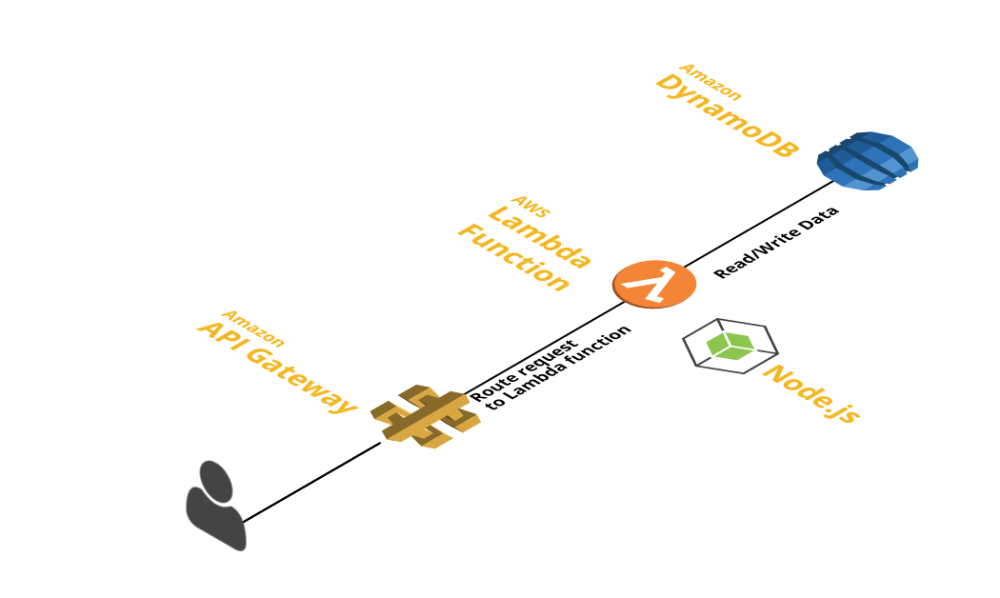

ExpressApi
==========

This project is a Boilerplate for building RESTful API with Node.js, Express and DynamoDB. Deployed in a server-less way to AWS Lambda and AWS API Gateway using Claudia.js and dev local using gulp

Architecture
------------

Simple REST API deplyed in AWS Lambda persisting data into DynamoDB and retrieving data back.

Express is a minimal and flexible Node.js micro web application framework. Express provides HTTP utility methods and middleware to create quick API.

API Gateway and Lambda together provides a secure, easy and elegant way to create and deploy serverless Web applications without the overhead of managing servers.

Amazon DynamoDB is a fully managed and hosted AWS NoSQL database service.

Claudia.js is an open source Node.js deployment tool that helps automated deployment of Node.js app in a server-less way to AWS Lambda and AWS API Gateway.



-	[Express](https://expressjs.com/en/4x/api.html)
-	[Claudia.js](https://claudiajs.com/tutorials/serverless-express.html)
-	[Migrating an Express Application to Amazon API Gateway and AWS Lambda](https://aws.amazon.com/blogs/compute/going-serverless-migrating-an-express-application-to-amazon-api-gateway-and-aws-lambda/)
-	[aws-serverless-express](https://github.com/awslabs/aws-serverless-express)
-	[DynamoDB and Node.js](http://docs.aws.amazon.com/amazondynamodb/latest/gettingstartedguide/GettingStarted.NodeJs.html)

Getting Started
---------------

The easiest way to get started is to clone the repository:

### Get the latest snapshot

```shell
git clone --depth=1 git@github.com:ravishan16/ExpressApi.git myproject
cd myproject
```

### Install NPM dependencies

```shell
npm install
```

To Install Gulp commandline run

```shell
sudo npm install -g gulp
```

Start App Local
===============

Execute gulp. This invokes app.local.js under scripts. gulp-nodemon Automatically restart Node.js server on code changes.

```
gulp
```

### Express App deployment in AWS

Deploying a NodeJS app to AWS can be done is so many different ways. One of the easiest way is to use `ClaudiaJS` and deploy the app in a server-less way to AWS Lambda and AWS API Gateway.

1.	Configure awscli
2.	Create table in DynamoDB
3.	Deploy App to AWS
4.	Push changes to AWS

### Configure awscli

```shell
pip install awscli
aws configure
AWS Access Key ID [None]: XXXX
AWS Secret Access Key [None]: XXXX
Default region name [None]: us-east-1
Default output format [None]: json
```

Create Tables in DynamoDB
-------------------------

create-db is defined as task in package.json script. This executes scripts/createDB.js

```shell
npm run create-db
```

### Deploy App to AWS

Use deploy for first time deployment. deploy is defined as npm run task in package.json script

claudia create --policies policies --handler lambda.handler --deploy-proxy-api --region us-east-1

```shell
npm run deploy
```

### Push changes to AWS

Use update for update to initial deployment. update is defined as npm run task in package.json script

claudia update

```shell
npm run update
```
